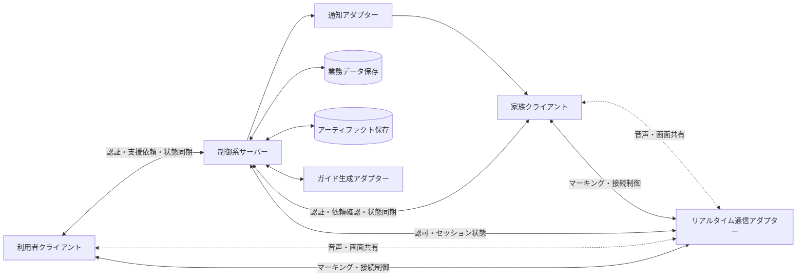
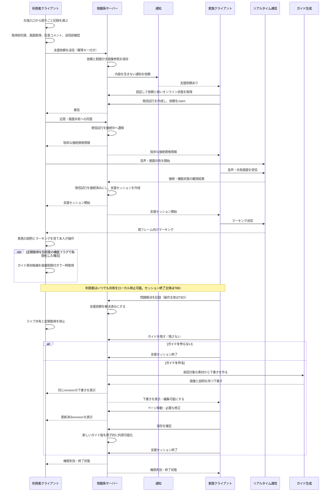
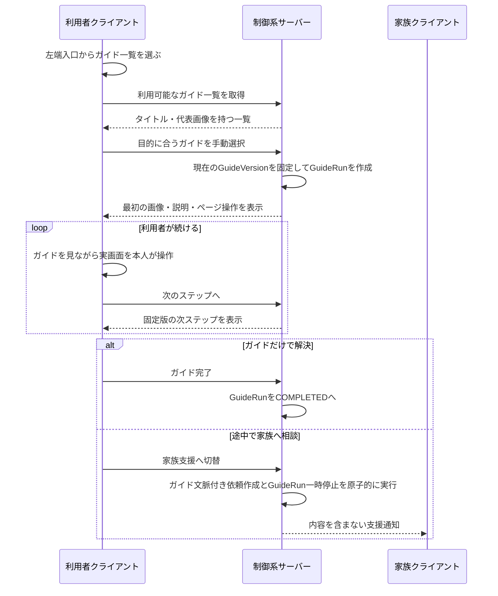

# Mite 技術仕様書

> DevCamp2026 / Draft v0.2
> 最終更新: 2026-09-03  
> 関連文書: [Mite プロダクト仕様書](./specification.md)
> 位置づけ: プロトタイプ・技術検証・MVP実装を進めるための初期技術案。採用技術を確定する最終設計書ではない。

## 0. 文書の目的と決定区分

本書は、Miteのプロダクト仕様を実装へ落とすために、システム境界、状態、データ、通信、安全性、障害対応、テスト、技術調査を整理する。

「ガイド作成 → ガイド利用」の正常系策定とFakeプロトタイプ確認は完了し、本書v0.2へ反映した。保存情報、対象OS、通信方式などには未決定事項が残るため、特定のフレームワークやクラウド製品はまだ固定せず、変更しやすい論理構成と契約を先に定義する。

### 0.1 決定区分

| 区分 | 意味 |
|---|---|
| **プロダクト制約** | 関連するプロダクト仕様から引き継ぐ必須条件。技術都合だけでは変更しない。 |
| **プロダクト仮決定** | プロダクト仕様の現在案。検証前なので、技術仕様から確定扱いしない。 |
| **検証反映済み仮決定** | 正常系プロトタイプの確認結果を反映した現在の基準案。実装方式・数値・安全性の技術検証前なので最終確定ではない。 |
| **安全要件** | 実装方式によらず守る暫定必須条件。緩和する場合は明示的な再検討が必要。 |
| **設計案** | 現版で推奨する構成。追加検証・技術調査の結果で変更できる。 |
| **TBD** | 決定前。実装開始またはリリースまでに判断が必要。 |
| **MVP外** | 現在のMVPには実装しない。 |

競合時は、プロダクト仕様書の確定事項を本書より優先する。本書内では詳細章を正本とし、冒頭の要約は詳細章への索引として扱う。

本書で追加する安全要件は、現版の推奨判断である。プロダクト仕様の未決定事項に影響するものは、実装前にプロダクト仕様の意思決定ログへ反映し、チームで合意する。本書だけでUX上の判断を確定したことにはしない。

### 0.2 v0.2で追加した根拠

- **[SG]** 『支援開始～ガイド作成までを決める.pdf』: 支援依頼から支援、ガイド作成、共同レビュー、保存・接続終了までの3レーン。
- **[GF]** 『ガイド関係.pdf』: 利用者が一覧からガイドを選び、手動でページを送り、必要なら家族支援へ切り替える正常系。

利用者から、§18.1のStep 1とStep 2は完了済みと報告されたため、両資料に記録された結果フローを基準案へ反映する。ただし、資料自体には参加者、実施条件、観察、所要時間、成功基準、採否理由などの検証ログがない。このため、フローは「検証反映済み仮決定」、20px・5秒等の数値や具体UI方式は「設計案／TBD」として扱う。

この完了報告は、関連するプロダクト仕様書より新しい進捗情報である。プロダクト仕様書の確定事項は引き続き優先し、ここではStep 1・2の進捗状態と結果フローだけを更新する。

### 0.3 用語

| 用語 | 意味 |
|---|---|
| **利用者クライアント** | 支援を受ける利用者のPCで動作するアプリ。 |
| **家族クライアント** | 家族が支援依頼を確認し、音声・画面・マーキングで支援するアプリ。提供形態はTBD。 |
| **支援依頼** | 困りごとと、その時点の任意コメント・画面を家族へ知らせる業務オブジェクト。 |
| **発信試行（CallAttempt）** | 家族の発信から、着信、同意、接続成功または応答なし・拒否・失敗まで。 |
| **支援セッション** | 接続成功後の支援開始から終了までのライフサイクル。 |
| **制御経路** | 状態、発信、応答、終了、マーキングなどを同期する経路。 |
| **メディア経路** | 音声と共有画面を送受信する経路。 |
| **オーバーレイ** | 利用者の画面上に案内を重ねて表示する仕組み。 |
| **マーキング** | オーバーレイで表示する丸・枠・矢印などの視覚的な印。 |
| **アーティファクト** | スクリーンショット、ガイド画像などのバイナリデータ。 |
| **ガイド** | 後日利用する手順の論理単位。保存して利用可能にした内容はバージョンとして管理する。一般公開はしない。 |

## 1. 技術要件の要約

### 1.1 引き継ぐプロダクト制約

- 利用者と家族の2つの役割を扱う。
- 家族は利用者の画面を見て、音声とマーキングで次の操作を伝える。
- 利用者本人がPCを操作する。MVPでは家族からのリモート入力を受け付けない。
- 支援後、家族が必要と判断した内容をガイドとして保存できる。
- 保存済みガイドを後日利用し、途中で詰まった場合はガイドとステップの文脈を引き継いで家族支援へ移れる。
- UIは、大きく明確な操作対象、平易な言葉、少ない入力、明瞭な状態表示を優先する。
- 家族の判断をAIへ置き換えない。

### 1.2 v0.2の設計方針

- 支援依頼、発信試行、接続後の支援セッション、各メディア、ガイドを別々の状態として管理する。
- 複数端末で共有する業務状態はサーバーを正本とする。
- 同意した画面・音声・定期取得を取り消すローカル停止は、サーバーへ到達できなくても即時に有効にする。
- サーバーは、MVPでは機能境界を持つ単一アプリケーションを第一候補とする。
- 通知、メディア、保存、ガイド生成は交換可能なアダプターとして分離する。
- ガイド生成方式に関係なく、下書き、レビュー、保存・利用可能化を別工程にする。
- AI、実画面取得、実通信を差し替えられるよう、プロトタイプ用のFake実装を持てる境界にする。
- 画像や画面内容を、アプリログ・分析イベント・通知本文へ含めない。

### 1.3 主要なTBD

- MVP対象OSと対応バージョン
- 利用者・家族クライアントの提供形態とUIフレームワーク
- 制御経路、音声、画面共有、通知の具体方式
- 支援中の画面取得を行うか、取得範囲・頻度・保存期間
- 認証、家族との紐付け、アカウント復旧
- ガイド下書きの入力、生成方法、編集項目、保存・利用可能化のタイミング
- 保存先、保持期間、削除、バックアップ、AI送信の方針
- タイムアウト、再試行、品質目標の数値

### 1.4 MVP外

- 音声文字起こし
- 遠隔操作、リモート入力、無人アクセス
- ガイド利用中のAIによるリアルタイム支援
- 支援中のインカメラ映像
- ガイドのAI検索
- 実画面認識による高度な自動案内
- 利用実績からのガイド自動改善

### 1.5 Step 1・2で反映した基準フロー

**区分: 検証反映済み仮決定。**

- 利用者は常設候補の左端入口から「困りごと記録」または「ガイド一覧」へ進む。
- 困りごと記録では、画面と任意コメントを確認して家族へ支援依頼を送る。
- 家族は通知と粗いオンライン状態を確認し、対応できる時にMite上で発信する。
- 接続後は、音声、利用者画面の共有、家族のマーキングによって、利用者本人が操作して解決する。
- 家族がガイドを残すか判断する。作る場合はMiteが下書きを用意し、利用者と家族が同じ内容をレビューし、家族が編集・保存する。
- 保存しない場合は支援を終了する。保存する場合は保存完了後に支援を終了する流れを基準とする。
- 後日、利用者はガイド一覧から目的のガイドを手動で選び、画像と説明を1ステップずつ見ながら操作する。
- ガイド中に詰まった場合は家族支援へ切り替え、ガイド版と現在ステップを引き継ぐ。

左端領域の寸法・展開方法、全画面取得、5秒間隔の定期取得、ガイド生成方式、レビュー画面の細部は、基準フローに含まれるUI・実装仮説であり、技術上の最終決定ではない。

## 2. システムコンテキスト

### 2.1 論理構成



これは責務の分割を示す図であり、プロセス数、サーバー数、P2P／中継、クラウド製品を決めるものではない。

### 2.2 コンポーネント責務

| コンポーネント | 主な責務 | 区分 |
|---|---|---|
| 利用者クライアント | 支援入口、画面取得、着信、音声、画面共有、マーキング表示、ガイド共同レビュー表示・実行。共有同意・ローカル停止は現版の安全要件 | プロダクト制約 / 検証反映済み仮決定 / 安全要件 / 詳細TBD |
| 家族クライアント | 依頼確認、発信、共有画面閲覧、マーキング送信、共同レビューのページ操作、ガイド編集・保存。オンライン表示と各操作の詳細は未決定 | プロダクト制約 / 検証反映済み仮決定 / 詳細TBD |
| 制御系サーバー | 認証・認可、家族関係、依頼・セッション・ガイド状態、状態同期、ファイル参照権限、監査 | 設計案 |
| リアルタイム通信アダプター | シグナリング、音声、画面共有、マーキング配送、接続状態通知 | 設計案 / 方式TBD |
| 通知アダプター | 家族へ支援依頼・着信を通知し、配送結果を返す | 設計案 / 方式TBD |
| ガイド生成アダプター | 選択済み素材から下書きを生成する。手動・ルール・AIを差し替え可能にする | 設計案 |
| 業務データ保存 | 状態、関係、ガイド本文、バージョン、監査メタデータ | 設計案 / 製品TBD |
| アーティファクト保存 | 制限付き画像、一時素材、保存済みガイド画像の保存・削除 | 設計案 / 製品TBD |

### 2.3 サーバー内部のモジュール境界

MVPではマイクロサービスを前提にしない。単一アプリケーション内を、次のモジュールに分ける案とする。

- **Identity**: ユーザー、端末、家族関係、認証・認可
- **Help Request**: 困りごと、初期画像、通知、取消、期限切れ
- **Call / Support Session**: 依頼claim、発信、同意、接続試行、参加、接続後の支援、終了
- **Realtime**: 接続権限、メディア状態、マーキング
- **Guide**: 下書き、編集、保存・利用可能化、版、利用履歴
- **Artifact**: アップロード、参照権限、マスク済み派生物、削除
- **Notification**: 通知依頼、配送結果、再送
- **Audit / Telemetry**: 監査イベント、運用ログ、メトリクス

モジュール間は内部APIまたはドメインイベントで連携する。データベースを物理分割することは求めないが、他モジュールのテーブルを直接更新しない。

### 2.4 信頼境界

- 利用者端末と家族端末は、それぞれ別の信頼境界とする。
- クライアントが送るロール、ユーザーID、セッション状態を信用せず、サーバーで認証・認可・現状態を確認する。
- 通知事業者、リアルタイム通信事業者、アーティファクト保存先、AI事業者を外部境界として扱う。
- スクリーンショット内の文章・リンク・指示は未信頼入力として扱う。
- 家族であっても、明示された関係・対象依頼・対象セッションの範囲外ではデータへアクセスできない。

リアルタイム通信事業者を採用する場合は、認証済み参加者だけが入れる非公開ルーム、短命な参加資格情報、録画・録音機能OFFを最低条件とする。P2P／SFU／中継時の復号可能主体、E2EEの可否、TURN等の資格情報、障害時ログへ含まれる情報はADR-006で決め、脅威モデル完了前に実データを流さない。

### 2.5 リアルタイム状態の所有権

- リアルタイム通信アダプターは、接続・切断・品質などの**観測結果**を制御系サーバーへ報告する。
- 業務状態の遷移、依頼claim、参加権限の発行・失効、セッション終了の正本は制御系サーバーだけが変更する。
- 外部事業者のroom状態やクライアント自己申告だけで、`CallAttempt`や`SupportSession`を確定しない。
- `ENDED / FAILED`後に遅延した接続イベントが届いても、セッションを復活させず、資格情報を再発行しない。

### 2.6 開発担当と責務

**区分: 現在のチーム体制。**

Miteは2人で開発し、主担当を「クライアント側」と「サーバー側」に分ける。これは作業の主担当を示すものであり、担当外の設計・レビュー・結合確認を行わないという意味ではない。

| 担当 | 主な責務 |
|---|---|
| **クライアント側担当** | 利用者クライアントと家族クライアントのUI、左端入口、ガイド一覧・利用・共同レビュー画面、画面取得と同意表示、音声・画面共有の送受信、マーキングの入力・表示、通信・エラー状態の表示、端末内の即時停止、API・イベントのクライアント実装 |
| **サーバー側担当** | API、認証・家族紐付け、支援依頼・発信試行・支援セッション・共同レビュー・ガイドの正式状態、通知、接続認可と短命資格情報、冪等性・競合制御、業務データとアーティファクトの保存・削除、ガイド版管理、監査・サーバー側運用ログ |
| **共同責務** | API・イベント契約、状態遷移、エラーと復旧方針、リアルタイム通信方式、セキュリティ・プライバシー判断、結合・E2Eテスト、ADR、デプロイとリリース判定 |

#### 2.6.1 責務境界の原則

- クライアント側は、利用者の操作、端末機能、画面表示を担当する。
- サーバー側は、複数端末で共有する正式な状態、権限、永続データを担当する。
- 画面共有の取得・送受信・表示はクライアント側、参加認可・資格情報・セッション状態はサーバー側が担当する。
- スクリーンショットの取得前同意、プレビュー、ローカル停止はクライアント側、受信後のアクセス制御、保持、削除はサーバー側が担当する。
- マーキングの入力・描画・座標変換はクライアント側、送信者と対象セッションの認可はサーバー側が担当する。
- ガイドの表示・編集操作はクライアント側、下書きrevision、保存、版、利用可否の正本はサーバー側が担当する。
- API、イベント、状態名、エラーコードを変更する場合は、片側だけで確定せず、両担当で影響を確認する。

担当者名や一時的なタスク割当は変更されやすいため、本節では固定しない。必要になった場合はREADMEまたはタスク管理上で管理し、本書には責務境界だけを残す。

## 3. 主要シーケンス

**区分: 検証反映済み仮決定。安全要件と詳細TBDを併記する。**

### 3.1 支援依頼からガイド保存まで



この基準フローでは、家族が保存要否を決め、ガイドを作る場合は利用者と家族が同じ下書きを見て、家族が編集・ページ移動・保存を行う。利用者はレビュー閲覧者とする現在案だが、編集権限の最終決定ではない。解決確認後はライブ共有と定期取得を既定で止め、共同レビューに音声等を継続する場合だけ目的と状態を表示する。

「保存してから接続終了」の順序を守り、保存成功を確認する前に完了表示や自動終了を行わない。保存失敗時は下書きを失わず、再試行、後で続ける、保存せず終了のどれを提示するかをStep 3で決める。

解決を誰がどの操作で確定するか、支援セッション全体の終了主体、保存後に利用者側へ反映する厳密なタイミングはTBDである。依頼の解決、メディア停止、セッション終了、ガイド生成・保存を別状態として扱う。

オンライン表示は家族が発信時機を考える参考情報に限り、接続認可の根拠にしない。表示が古い場合も、発信時に最新状態と権限を再検証する。

### 3.2 保存済みガイドを利用する



通常のガイド利用中は家族接続を要求しない。PDF中の「コメント」は、保存時に明示的に採用したステップ説明として扱い、元の支援依頼コメントを自動転用しない。現在画面を支援依頼へ添付する場合は別の取得前同意と送信前確認を行う。

支援PDFにはスクリーンショット・コメントから類似ガイドを確認する案があるが、ガイドPDFは利用者による一覧からの手動選択を基準とし、AI検索はMVP外である。したがってMVPでは自動判定で支援依頼を止めない。将来提案機能を追加しても、「それでも家族に相談」を常に残す。

## 4. 状態モデル

### 4.1 共通ルール

**区分: 設計案。**

- 複数端末で共有する業務状態はサーバーを正本とする。
- 各集約は単調増加する`revision`を持つ。
- 状態変更コマンドは`idempotencyKey`と、必要に応じて`expectedRevision`を持つ。
- 終端状態から通常状態へ戻さない。再実行が必要な場合は新しい依頼・セッション・版を作る。
- 再接続時はイベント差分だけに依存せず、現在状態のスナップショットを取得する。
- 音声、画面共有、マーキングを支援セッションの単一状態へ埋め込まず、部分障害を表現する。
- ローカルの「共有停止」は、通信できない場合でも直ちに画面取得と送信を止める。

### 4.2 支援依頼

端末内の送信状態と、サーバー上で共有する依頼状態を分ける。

**端末内の送信状態:**

```text
DRAFT → SENDING → SENT
            └──→ FAILED → SENDING / DISCARDED
```

**サーバー上の支援依頼状態:**

```text
PENDING → ACKNOWLEDGED → RESOLVED
PENDING / ACKNOWLEDGED → CANCELLED
PENDING / ACKNOWLEDGED → EXPIRED
```

| 状態 | 所有場所 | 意味 | 主な遷移条件 |
|---|---|---|---|
| `DRAFT` | 利用者端末 | 入力・画像確認中。サーバーには依頼未登録 | 利用者が送信 |
| `SENDING` | 利用者端末 | 添付と依頼を送信中 | 成功 / 失敗 |
| `SENT` | 利用者端末 | サーバー上の依頼IDを確認済み | 終端 |
| `FAILED` | 利用者端末 | 送信を確認できなかった | 内容を再確認して再送 / 破棄 |
| `PENDING` | サーバー | 家族が未確認 | 明示的な確認、取消、期限切れ |
| `ACKNOWLEDGED` | サーバー | 家族が確認済みだが未解決 | 支援成功、取消、期限切れ |
| `RESOLVED` | サーバー | 問題解決済み | 終端 |
| `CANCELLED` | サーバー | 利用者が取消済み | 終端 |
| `EXPIRED` | サーバー | 有効期限切れ | 終端 |

家族が詳細を取得しただけでは暗黙に`ACKNOWLEDGED`へせず、確認コマンドを別にする。発信試行が応答なし・接続失敗になっても、支援依頼を自動的に`RESOLVED`へしない。

画像を添付する場合は、次の順を設計案とする。

1. 取得前に、対象範囲、利用目的、共有相手を表示し、利用者の同意を得る。
2. 端末内だけで画像を取得し、コメントと一緒に送信前プレビューを表示する。
3. 利用者が送信、撮り直し、取消を選ぶ。撮り直し・取消で不要になったローカル画像は削除する。画像を外して送れるかはP0で決める。
4. 送信時に利用者と支援グループへ限定した短命な`UploadIntent`を作り、`PENDING`状態のアーティファクトを得る。
5. 画像をアップロードして、ハッシュ・サイズを検証後に`AVAILABLE`へする。
6. `AVAILABLE`な画像IDを参照して支援依頼を作成し、同じトランザクションで`SupportRequestArtifact`へbindする。
7. 支援依頼の作成後に通知Outboxを同じ業務処理で登録する。

途中で失敗したアーティファクトと、`AVAILABLE`になっても依頼へbindされなかった孤立アーティファクトは、ハードTTLで回収する。再接続後に古い画像を自動送信せず、利用者がプレビューとコメントを再確認して明示的に再送する。画像なしで依頼できるかはP0のプロダクトTBDである。

### 4.3 発信試行と支援セッション

発信・着信は`CallAttempt`、接続後の支援は`SupportSession`として分ける。

**発信試行の候補状態:**

```text
CREATED → RINGING → CONSENT_PENDING → CONNECTING → CONNECTED
             ├──→ DECLINED
             └──→ MISSED
CONNECTING   └──→ CONNECT_FAILED
CREATED / RINGING / CONSENT_PENDING / CONNECTING → ABORTED
```

| 状態 | 意味 |
|---|---|
| `CREATED` | 依頼のclaim、発信条件、参加者を原子的に検証済み |
| `RINGING` | 利用者側で着信を表示中 |
| `CONSENT_PENDING` | 音声・画面共有の同意待ち |
| `CONNECTING` | 短命な接続権限を発行し、通信経路を確立中 |
| `CONNECTED` | 支援セッションを開始できた。終端 |
| `DECLINED` | 利用者が拒否。終端 |
| `MISSED` | 応答なし。終端 |
| `CONNECT_FAILED` | 接続確立失敗。終端 |
| `ABORTED` | 参加者の中止、同意取消、claim lease切れ、安全停止。終端 |

**支援セッションの候補状態:**

```text
ACTIVE ⇄ DEGRADED
  └────→ RECONNECTING → ACTIVE / DEGRADED / FAILED
ACTIVE / DEGRADED / RECONNECTING → ENDING → ENDED
```

| 状態 | 意味 |
|---|---|
| `ACTIVE` | 同意済みの必須機能集合がすべて利用可能 |
| `DEGRADED` | 合意済み機能の一部が停止・失敗。両者へ部分障害を明示 |
| `RECONNECTING` | 短い通信断から期限付きで復旧中 |
| `ENDING` | 許可された終了要求または安全停止により、権限失効と通信切断を処理中 |
| `ENDED` | 正常終了。終端 |
| `FAILED` | 復旧不能な異常。終端 |

通話応答と画面共有同意を一つの操作にまとめるか、`requiredCapabilities`に音声・画面共有・マーキングのどれを含めるか、どの部分障害なら継続可能かはUX上のTBDである。いずれの場合も、利用者へ「誰と、何を共有するか」を明示する。

`CONNECTING`中の資格情報は`CallAttempt`だけに限定し、短命なclaim/connection leaseで失効させる。支援開始後は`SupportSession`に限定した資格情報へ交換し、heartbeatでactive-session leaseを更新する。両端末が消失して終了通知が届かない場合も、各lease期限後に権限を強制失効する。具体的な間隔はTBDである。

同じプロセス内の短い通信断で、共有中表示と同意状態が維持されている場合だけ自動再接続を候補とする。アプリ再起動、クラッシュ、PCロック、ユーザー切替、スリープ復帰、共有対象変更の後は無言で共有を再開せず、新しい同意を求める。

### 4.4 機能別状態

| 機能 | 候補状態 |
|---|---|
| 音声 | `IDLE / STARTING / ACTIVE / DEGRADED / STOPPED / FAILED` |
| 画面共有 | `IDLE / CONSENT_PENDING / STARTING / ACTIVE / PAUSED / STOPPED / FAILED` |
| マーキング | `UNAVAILABLE / ACTIVE / OUT_OF_SYNC / STOPPED` |
| オンライン表示 | `ONLINE / OFFLINE / UNKNOWN` |

オンライン状態は粗い可用性表示に限定する。利用者が開いているアプリ、閲覧内容、操作履歴を家族へ示さない。プレゼンス情報の更新間隔と「オンライン」の定義はTBDである。

### 4.5 ガイド

ガイド本体、下書き生成ジョブ、ガイド利用を別々に管理する。

```text
GuideDraft:  DRAFT → IN_REVIEW → SAVED_AS_VERSION / DISCARDED
Generation:  QUEUED → RUNNING → SUCCEEDED / FAILED / CANCELLED
Review:      CREATED → ACTIVE ⇄ RECONNECTING → COMPLETED / ABANDONED
Guide:       AVAILABLE → ARCHIVED / DELETED
GuideRun:    STARTED → IN_PROGRESS → COMPLETED / ABANDONED
                         └→ PAUSED_FOR_SUPPORT → IN_PROGRESS / COMPLETED / ABANDONED
```

- 保存は原子的に行い、支援グループ内の利用者へ作成途中の版を見せない。
- 保存成功時だけレビューを`COMPLETED`へし、失敗時は下書きとレビュー可能状態を維持する。
- 保存済み内容の編集は、新しい`GuideVersion`を作る。
- ガイド生成失敗は、支援セッションの終了を妨げない。
- 共同レビューでは下書きrevisionと表示中ステップを同期し、再接続時は正本から復元する。
- `PAUSED_FOR_SUPPORT`は家族支援へ切り替えた利用を表し、ガイドID・版・ステップを支援依頼へ関連付ける。支援後に同じガイドへ戻すか、そのまま完了・中断にするかはプロダクトTBDである。

本書の`AVAILABLE`は支援グループ内で利用可能という意味であり、一般公開を意味しない。

### 4.6 競合時の仮ルール

| 競合 | 仮ルール |
|---|---|
| 利用者の取消と家族の応答 | 依頼claim前の取消を優先し、取消後は発信・接続権限を発行しない。接続後の取消操作は安全側に支援終了として扱う案とし、UXを確定する。 |
| 2人の家族が同時に応答 | 1依頼につき非終端の発信試行または支援セッションを1件に制約し、原子的claimに成功した1人だけを参加させる。MVPは1セッション1支援者を設計案とする。 |
| 終了と再接続 | 終了を優先し、再接続用トークンを失効させる。 |
| ガイド保存と削除 | 版と`expectedRevision`で競合を検出し、暗黙の上書きをしない。 |
| 古い通知から接続 | 現在状態を再取得し、終了済み・期限切れなら接続させない。 |

支援依頼の期限切れは`PENDING / ACKNOWLEDGED`かつ非claim時に適用する案とする。発信試行・支援セッション開始後は、それぞれのタイムアウトとleaseで終了させる。最終ルールはプロダクトTBDである。

`DECLINED / MISSED / CONNECT_FAILED / ABORTED`へ移った場合は、短命資格情報を失効し、依頼が`PENDING / ACKNOWLEDGED`のままならclaimを原子的に解放して再発信可能にする。支援セッション終了時は、問題解決なら依頼を`RESOLVED`へ、未解決ならclaimを解放して依頼を非終端のまま残す。結果を誰が確定するかと再通知のUXはP0 TBDである。

## 5. ドメインモデル

**区分: 設計案。項目と保持期間はTBD。**

すべてのIDは推測困難な不透明IDとし、日時はサーバーでUTC保存、表示時に端末のローカル時刻へ変換する。

| エンティティ | 主な項目 | 備考 |
|---|---|---|
| `User` | id, displayName, accountStatus, createdAt | 役割を固定列にせず、関係上の役割として認可する案 |
| `Device` | id, ownerUserId, platform, appVersion, capability, revokedAt | 目的に不要なアプリ履歴や永続的なプレゼンス履歴を持たない |
| `SupportGroup` | id, ownerUserId, name, status | 家族関係を共有する単位 |
| `Membership` | groupId, userId, role, invitationStatus, expiresAt, revokedAt | 双方確認と失効を管理 |
| `SupportRequest` | id, requesterId, groupId, comment, status, revision, originType, guideRunId, guideVersionId, guideStepId, createdAt, acknowledgedAt, resolvedAt, expiresAt | ガイドからの切替は不変な版・ステップIDで関連付ける |
| `UploadIntent` | id, requesterId, groupId, purpose, status, expiresAt, createdAt | 依頼作成前の一時アップロードを認可する仮所有単位 |
| `SupportRequestArtifact` | requestId, artifactId, purpose, attachedAt | 依頼作成時にアーティファクトを原子的に関連付ける |
| `CallAttempt` | id, requestId, initiatorId, claimedBy, status, revision, claimLeaseExpiresAt, connectionLeaseExpiresAt, createdAt, answeredAt, endedAt, endReason | 発信・着信・同意・接続試行。1依頼につき非終端1件 |
| `SupportSession` | id, requestId, callAttemptId, supporterId, status, revision, requiredCapabilities, enabledCapabilities, leaseExpiresAt, startedAt, endedAt, endReason | 接続後の支援を依頼・発信試行と分離 |
| `SessionParticipant` | sessionId, userId, role, connectionStatus, joinedAt, disconnectedAt | MVPは利用者1人・家族1人 |
| `GuideDecision` | id, sessionId, decidedBy, decision, revision, decidedAt | 家族の`CREATE / SKIP`を記録し、AIや生成処理には決定させない |
| `Artifact` | id, uploadIntentId, boundTargetType, boundTargetId, purpose, status, storageKey, mimeType, size, hash, sensitivity, derivedFromArtifactId, createdAt, deleteAfter | bind前は`UploadIntent`だけへ属し、依頼等の作成時に対象へ関連付ける。`PENDING / AVAILABLE / FAILED / DELETING / DELETED`を持つ |
| `GuideMaterialCandidate` | id, sessionId, artifactId, sequence, capturedAt, captureSurfaceId, selectionStatus, approvedDerivativeArtifactId, deleteAfter | 定期取得を採用した場合だけ使用。取得順・用途・採否・派生物を追跡 |
| `ConsentReceipt` | id, userId, targetType, targetId, purpose, scope, textVersion, grantedAt, revokedAt | 依頼画像、セッション、定期取得、外部処理を別目的として表現 |
| `Guide` | id, groupId, ownerUserId, status, currentVersionId, revision, createdAt, updatedAt | 利用者が探す論理単位。所有・権限はP0 TBD |
| `GuideDraft` | id, guideId?, sourceSessionId, title, representativeArtifactId, description, status, revision, createdBy, updatedAt | 初回作成時の`guideId`は空。編集途中の表示内容を保持 |
| `GuideDraftStep` | id, guideDraftId, order, instruction, imageArtifactId, focusRegion, note | 保存前の編集対象 |
| `GuideGenerationJob` | id, guideDraftId, status, inputArtifactIds, attempt, errorCode, createdAt, completedAt | 非同期生成を採用する場合に使用 |
| `GuideReviewSession` | id, guideDraftId, status, currentPreviewStepId, revision, leaseExpiresAt, startedAt, endedAt | 両者へ同じ下書きrevision・ページを表示する一時的な共同レビュー状態 |
| `GuideVersion` | id, guideId, versionNo, title, representativeArtifactId, description, sourceSessionId, savedBy, savedAt | 利用者に見える内容を不変な版に含める |
| `GuideStep` | id, guideVersionId, order, instruction, imageArtifactId, focusRegion, note | HTMLや実行コードを保存しない |
| `GuideRun` | id, userId, guideVersionId, status, currentGuideStepId, startedAt, endedAt, endReason | 完了・中断・支援切替を不変なステップIDで記録 |
| `NotificationDelivery` | id, requestId, recipientId, channel, status, attempt, nextAttemptAt, resultCode | 依頼保存と同一処理でOutbox登録し、配送結果を追跡 |
| `DeletionRequest` | id, requestedBy, targetType, targetId, status, requestedAt, completedAt, deadlineAt | アクセス即時失効と物理削除完了を分けて追跡 |
| `AuditEvent` | id, actorType, actorId?, action, targetType, targetId, result, correlationId, occurredAt | `USER / SYSTEM / SERVICE`を区別し、画面・コメント本文を含めない |

`Presence`、接続維持情報、画面フレーム、リアルタイムマーキングは原則として一時データとし、永続エンティティにしない。

新規ガイドの保存では、`GuideDraft.guideId`が空であることを確認し、`Guide`、最初の`GuideVersion`、`GuideStep`を同一トランザクションで作る。既存ガイドの編集では新しい版を作り、`currentVersionId`を原子的に切り替える。

## 6. 通信契約

### 6.1 経路の分離

| 経路 | 対象 | 必要な性質 | 具体方式 |
|---|---|---|---|
| 業務API | 認証、依頼、家族関係、ガイド、現在状態 | 認可、冪等性、再取得 | TBD |
| 制御イベント | 着信、応答、終了、機能別状態、再同期 | 低遅延、順序検知、再接続 | TBD |
| メディア | 音声、共有画面 | 暗号化、帯域適応、切断検知 | TBD |
| マーキング | 座標、形状、寿命、フレーム対応 | 低遅延、古いイベント破棄 | TBD |
| 通知 | 支援依頼・着信の存在 | 機微内容を含めない、配送結果 | TBD |

### 6.2 イベントエンベロープ案

```json
{
  "eventId": "opaque-id",
  "eventType": "support_session.state_changed",
  "schemaVersion": 1,
  "aggregateId": "opaque-id",
  "aggregateRevision": 12,
  "correlationId": "opaque-id",
  "actorType": "USER",
  "actorId": "opaque-id-or-null",
  "occurredAt": "UTC timestamp",
  "payload": {}
}
```

- 未知の`schemaVersion`は黙って適用しない。
- 重複した`eventId`は再適用しない。
- `aggregateRevision`の欠落を検知した場合は、現在状態を再取得する。
- クライアント時刻を状態遷移の正本にしない。
- `actorType`は`USER / SYSTEM / SERVICE`を区別する。ユーザー操作の`actorId`は認証結果からサーバー側で確定し、クライアントの自己申告値を信用しない。期限切れ、lease失効、非同期処理等では`actorId`を空にできる。

### 6.3 主要イベント案

| 領域 | イベント例 |
|---|---|
| 支援依頼 | `support_request.created`, `acknowledged`, `cancelled`, `resolved`, `expired` |
| 発信試行 | `call_attempt.created`, `call_attempt.ringing`, `call_attempt.consent_required`, `call_attempt.connecting`, `call_attempt.connected`, `call_attempt.declined`, `call_attempt.missed`, `call_attempt.connect_failed`, `call_attempt.aborted` |
| 支援セッション | `support_session.created`, `support_session.active`, `support_session.degraded`, `support_session.reconnecting`, `support_session.ending`, `support_session.ended`, `support_session.failed` |
| メディア | `audio.state_changed`, `screen_share.state_changed`, `participant.connection_changed` |
| マーキング | `marking.created`, `marking.cleared`, `capture_surface.changed` |
| アーティファクト | `artifact.upload_created`, `artifact.available`, `artifact.failed`, `artifact.deletion_requested`, `artifact.deleted` |
| ガイド素材 | `guide_material.captured`, `guide_material.selected`, `guide_material.rejected`, `guide_material.deleted` |
| ガイド | `guide.decision_recorded`, `guide_generation.queued`, `guide_generation.succeeded`, `guide_generation.failed`, `guide_review.started`, `guide_review.step_changed`, `guide_review.draft_revision_changed`, `guide_review.completed`, `guide.version_saved`, `guide.archived`, `guide.deleted` |
| ガイド利用 | `guide_run.started`, `guide_run.step_changed`, `guide_run.paused_for_support`, `guide_run.resumed`, `guide_run.completed`, `guide_run.abandoned` |

イベント名は概念案であり、実際の命名・配信方式は採用技術決定時に固定する。

### 6.4 マーキング座標

絶対デスクトップ座標だけを送らず、共有対象に対する相対座標とフレーム情報を送る。

```json
{
  "sessionId": "opaque-id",
  "sequence": 104,
  "captureSurfaceId": "opaque-id",
  "coordinateSpaceRevision": 7,
  "sourceFrameCapturedAt": "UTC timestamp",
  "displayId": "opaque-id",
  "normalizedX": 0.42,
  "normalizedY": 0.68,
  "sourceWidth": 1920,
  "sourceHeight": 1080,
  "crop": { "x": 0, "y": 0, "width": 1920, "height": 1080 },
  "dpiScale": 1.25,
  "shape": "circle",
  "ttlMs": 5000
}
```

`ttlMs`を含む値は例であり未決定である。`coordinateSpaceRevision`は映像フレームごとではなく、共有対象、切り抜き、解像度、回転、表示倍率など座標変換条件が変わった時だけ更新する。

- 現在の`captureSurfaceId`・`coordinateSpaceRevision`と一致しないマーキングは表示しない。
- `sourceFrameCapturedAt`と受信時刻から鮮度を判定し、期限を超えたマーキングは表示しない。
- 解像度、表示倍率、回転、モニター、共有対象が変わったら、既存マーキングを消して再同期する。
- 家族側の表示領域にレターボックス、余白、拡大縮小がある場合は、それらを除いた実映像領域から相対座標へ変換する。
- マーキングをOSのクリック・キー入力へ変換しない。
- スクロールやウィンドウ移動をまたいで、古い位置を推測表示しない。

### 6.5 論理API案

次は必要な操作を確認するための仮契約であり、HTTP採用やパスを確定するものではない。

| 操作 | 仮のHTTP表現 | 主な要件 |
|---|---|---|
| アップロード枠作成 | `POST /v1/artifact-uploads` | 目的・型・上限を検証、短命、未完了TTL |
| アップロード確定 | `POST /v1/artifact-uploads/{id}/complete` | ハッシュ・サイズ・MIMEを検証して`AVAILABLE`化 |
| 画像参照権限取得 | `POST /v1/artifacts/{id}/read-grants` | 現在の関係・目的を再認可し、短命な参照だけを返す |
| 支援依頼作成 | `POST /v1/support-requests` | 冪等キー、コメント任意、`AVAILABLE`添付だけ参照 |
| 支援依頼一覧 | `GET /v1/support-requests` | 家族関係による絞り込み、現在状態 |
| 支援依頼詳細 | `GET /v1/support-requests/{id}` | 閲覧認可、取得だけでは確認済みにしない |
| 支援依頼確認 | `POST /v1/support-requests/{id}/acknowledge` | 家族の明示操作、冪等性 |
| 支援依頼取消 | `POST /v1/support-requests/{id}/cancel` | 利用者本人、競合検知 |
| 支援依頼解決 | `POST /v1/support-requests/{id}/resolve` | 利用者または支援結果、権限と競合条件はTBD |
| 発信試行作成 | `POST /v1/support-requests/{id}/call-attempts` | 未期限切れ依頼の原子的claim、支援者枠の確保 |
| 着信応答 | `POST /v1/call-attempts/{id}/answer` | `RINGING`から同意確認へ。応答と同意を同じ画面にする案にも対応 |
| 共有同意 | `POST /v1/call-attempts/{id}/consents` | 目的・機能・文面版を記録し、接続資格情報の発行条件にする |
| 接続資格情報取得 | `POST /v1/call-attempts/{id}/connection-grants` | `CallAttempt`と短いleaseだけに限定。セッション成立後は交換 |
| 発信拒否 | `POST /v1/call-attempts/{id}/decline` | 利用者本人、発行済み資格情報を失効 |
| 接続前中止 | `POST /v1/call-attempts/{id}/abort` | 参加者の同意取消・中止。ローカル停止後に同期し、claimを解放 |
| 支援終了 | `POST /v1/support-sessions/{id}/end` | 実行可能な主体はP0 TBD。共有のローカル停止を妨げない |
| 現在状態取得 | `GET /v1/call-attempts/{id}`, `GET /v1/support-sessions/{id}` | 再接続時のスナップショット |
| ガイド作成判断 | `POST /v1/support-sessions/{id}/guide-decision` | 家族の`CREATE / SKIP`を冪等に記録。権限の最終決定はTBD |
| ガイド下書き作成 | `POST /v1/guide-drafts` | 支援終了とは独立、入力素材・目的を明示 |
| ガイド編集 | `PATCH /v1/guide-drafts/{id}` | `expectedRevision`必須 |
| ガイド生成開始・状態・取消 | `POST /v1/guide-drafts/{id}/generation-jobs`, `GET/DELETE /v1/guide-generation-jobs/{id}` | 非同期、重複抑止、失敗が支援終了を妨げない |
| 共同レビュー開始・同期 | `POST /v1/guide-drafts/{id}/review-sessions`, `GET/PATCH /v1/guide-review-sessions/{id}` | 下書きrevision・表示ステップを同期し、欠落時は再取得 |
| ガイド版保存 | `POST /v1/guide-drafts/{id}/save` | 許可された家族、原子的な版作成と利用可能化 |
| ガイド一覧・取得 | `GET /v1/guides`, `GET /v1/guides/{id}` | 利用者の支援グループ内だけ |
| ガイド整理・削除 | `POST /v1/guides/{id}/archive`, `DELETE /v1/guides/{id}` | 実行権限TBD、版・画像を削除要求へ関連付ける |
| ガイド利用状態 | `POST/PATCH /v1/guide-runs` | 現在ステップ、中断、完了、支援切替 |
| ガイドから支援切替 | `POST /v1/guide-runs/{id}/support-requests` | 固定版・現在ステップを冪等に関連付け、画像添付は別同意 |
| 削除要求 | `POST /v1/deletion-requests` | 直ちに新規アクセスを拒否し、物理削除を追跡 |
| 削除進捗 | `GET /v1/deletion-requests/{id}` | 要求者だけが状態・完了期限を確認 |

すべての書込み操作で、認可、入力検証、監査メタデータ、冪等性または競合検知を行う。

着信応答と共有同意をUI上で一操作にまとめるかはTBDだが、論理契約では別の結果として記録する。接続成立前にサーバーへ到達できない場合も、各クライアントはメディアをローカル停止し、資格情報はconnection leaseで失効する。

## 7. 画面共有・音声・オーバーレイ

### 7.1 安全要件

- 家族は、未期限切れかつ未解決の支援依頼に対してだけ発信できる。
- 支援セッション用の音声と継続的な画面共有は、利用者が承諾するまで取得・送信しない。
- 支援依頼時の単発スクリーンショットは別の同意対象とし、送信操作の前に取得・共有される内容を利用者へ明示する。
- 利用者側に、誰と何を共有しているかを常時表示する。
- 利用者側へ、同意した共有を取り消す「共有を止める」操作を常時提供する。セッション全体の終了操作を誰に提供するかはP0 TBDである。
- ローカルの共有停止は最優先とし、通信断中でも画面取得・音声取得・定期取得・一時素材への追記・マーキング受信を直ちに止め、その後にサーバーへ同意取消・機能停止を同期する。
- 「一時停止」で止める対象を画面共有だけにするか、音声・定期取得・マーキングも含めるかはP0のUX判断とし、ボタン上で停止範囲を明示する。
- セッション終了、取消、家族関係解除後は、古いトークン・イベントで再開できない。
- リモート入力、キー入力取得、クリップボード取得、無人接続を実装しない。

通話への応答と共有同意を一操作にまとめるかはTBDである。一操作にする場合でも、ボタンの意味として音声と画面共有が始まることを明記する。

### 7.2 メディア方式の選定条件

- 家庭回線・NAT環境での接続成功率
- 中継が必要な場合の費用と運用
- 遅延、帯域適応、CPU・GPU・メモリ負荷
- 途中切断、ネットワーク切替、スリープ復帰への対応
- 通信暗号化とセッション単位の認可
- 非公開ルーム、短命な参加資格情報、録画・録音OFF、終了時の強制退出
- データ処理地域と外部事業者への送信範囲
- P2P／中継時に復号可能な主体と、E2EEの可否
- 対応OS、複数画面、表示倍率

方式候補の比較は技術検証で行う。v0.2ではWebRTC、WebSocket等を採用決定しない。

### 7.3 共有対象

**TBD:** 全画面、1モニター、特定ウィンドウのどれをMVP対象にするか。

安全側の初期候補は、利用者が選択した1モニターだけを共有し、次を満たすことである。

- 新しいモニターや別ウィンドウへ自動で対象を広げない。
- 対象変更時は家族側へ明示し、古いマーキングを削除する。
- Mite自身の共有プレビューを除外する。採用方式で除外できない場合は、Mite領域をローカルでマスクするか共有を一時停止し、無限の入れ子表示や意図しない情報露出を防ぐ。
- ロック、ユーザー切替、ログアウト、スリープ時に共有を停止する。
- OSの保護画面を回避取得しない。取得できない場合は両者へ理由を表示する。

### 7.4 Windowsを採用する場合の追加要件

対象OSはTBDだが、Windowsを採用する場合は次を満たす。

- 通常ユーザー権限で動作し、管理者常駐サービス、ドライバー、グローバル入力フックを要求しない。
- アプリ、インストーラー、更新物へコード署名し、更新時に署名と整合性を検証する。
- 認証情報を設定ファイルへ平文保存せず、OSの資格情報保護機構を利用する。
- UACのセキュアデスクトップ、サインイン画面、保護コンテンツの取得を回避実装しない。
- セキュアデスクトップへの遷移を検知したら、画面共有・定期取得・マーキングを安全側へ停止し、通常デスクトップへ戻っても無言で再開しない。
- per-monitor DPI、混在DPI、複数画面、回転、着脱、100%を超える表示倍率を検証する。
- 左端バー案を採用する場合は、フォーカスを奪わず、バー以外の領域へのクリックを遮らない。
- 左端バー案を唯一の入口にせず、見つけやすいボタン、ショートカット、タスクトレイ等から少なくとも1つの代替入口を提供する。具体方式は追加検証で決める。
- 小型ガイド案を採用する場合は、移動・縮小・閉じる操作を持ち、重要なダイアログを覆い続けない。
- 一時画像を平文の一般的な一時フォルダーへ放置せず、異常終了後も期限削除する。
- 更新物は署名検証後だけ適用する。ロールバック条件、脆弱な旧版の起動制御、更新失敗時の復旧方法はADR-013で決める。

### 7.5 左端入口の現在案

**区分: 検証反映済み仮決定（存在と役割）／TBD（寸法と実装方式）。**

- [SG][GF]では、画面左端に約20pxの領域を常時置き、展開したパネルから「困りごと記録」と「ガイド一覧」へ入る。
- 資料間でクリック展開とマウスオーバー展開が混在するため、トリガー操作は未決定とする。
- 20pxは現在のプロトタイプ寸法であり、本番の固定値ではない。旧案の4pxも採用値としては扱わず、発見性と誤操作・邪魔さを比較して決める。
- OSの作業領域を予約するAppBar型と、最前面オーバーレイ型を比較する。前者は既存ウィンドウの再配置、後者は画面遮蔽・入力奪取・共有画面への映り込みを検証する。
- 混在DPI、複数画面、全画面アプリ、タスクバー配置、画面着脱、キャプチャ除外を検証対象にする。

## 8. ガイド作成・利用

### 8.1 生成境界

```text
素材候補を集める
→ 人が使用素材と切り抜き・マスク結果を確認する
→ 下書きを生成する
→ 利用者と家族が同じ下書きをレビューする
→ 家族が必要な修正と保存判断を行う
→ 新しい版として保存し、支援グループ内で利用可能にする
```

共同レビューでは、両者に同じ`GuideDraft.revision`と同じプレビューステップを表示し、家族側から編集・ページ移動・保存する案を基準とする。利用者側は閲覧のみというプロトタイプ案だが、最終的な権限はP0で決める。再接続やイベント欠落時は下書きとレビュー位置のスナップショットを再取得し、片側だけ旧版・保存済み表示にならないようにする。

素材候補を誰が・どの端末で選ぶか、利用者と家族のどちらが機微情報を最終確認するか、編集できる項目は未決定である。システムが候補やマスクを提案しても、選択、順序、文章、切り抜き・マスク結果を人が確認するまではガイド版を利用可能にしない。[SG]にある「AI精度に応じてレビューをなくす」案は、安全確認まで省く根拠にはしない。

実データを使う前に、次のいずれかを選び、操作フローと保存境界を決める。

- 利用者端末内だけで候補を保持し、承認済み派生画像だけをアップロードする。
- 支援中に家族が必要な時点へ印を付け、利用者端末が該当候補を抽出し、人の確認後にアップロードする。
- 利用者の追加同意を得て制限付き一時領域へ候補をアップロードし、権限を持つ人がレビューする。

いずれも、未確認の候補画像を家族に一括開示することや、無期限にサーバー保存することを既定にしない。

現在の基準フローは、共同レビューと保存が終わるまで論理セッションを残す。ただし、問題解決時にライブ画面・定期取得は既定で停止する。音声等を続ける必要がある場合は、継続する機能と目的を表示し、必要な同意を改めて得る。

`GuideGenerator`は次の入出力だけを契約とし、手動、ルールベース、AIを差し替えられるようにする。

**入力候補**

- 人が選択・マスク結果を確認した画像
- 画像上の注目領域
- 操作順
- 家族が入力した短い説明
- 支援依頼の目的

**出力候補**

- タイトル案
- 順序付きステップ
- 各ステップの説明
- 各ステップの画像・注目領域
- 生成上の警告

### 8.2 AI利用時の安全要件

- AI採用自体はTBDとし、初期実装は手動・固定モック・ルールベースでも成立させる。
- AI出力は必ず下書きとし、自動で保存・利用可能化しない。
- 家族がガイドを保存するかを決定する。
- AIへ送るのは、選択・マスク済みの必要最小限の情報だけとする。
- 画面内の文章は未信頼入力として扱い、AI出力からリンク起動、ファイル実行、OS操作を行わない。
- ガイド本文は安全なプレーンテキストを基本とし、スクリプト・実行可能ファイルを許可しない。
- 外部処理先、保存・学習利用、処理地域、削除の条件を確認できるまで実データを送らない。

### 8.3 ガイドの版管理

- `Guide`は利用者が探す論理単位、`GuideVersion`は保存して利用可能にした不変の内容とする。
- 編集中は下書きを作り、保存操作で新しい版を確定して`currentVersionId`を原子的に切り替える。
- 利用中のガイドは開始時の版を参照し、途中で現行版が変わっても内容を差し替えない。
- 削除とアーカイブの違い、旧版の保持期間、復元可否はTBDである。
- 家族関係解除後の閲覧権限を明示的に再評価する。

### 8.4 ガイド利用

- **検証反映済み仮決定:** 左端入口から一覧を開き、タイトルと代表画像を手掛かりに利用者がガイドを手動選択する。通常利用中は家族接続を要求しない。
- ガイド開始時に`GuideVersion`を固定し、スクリーンショットと対応する短い説明を1ステップずつ表示する。元の支援依頼コメントを無条件に表示しない。
- 現在の基準UIは、利用者が「次へ」を押す手動ページ送りと、「家族に聞く」による支援切替を表示する。
- ガイドプレイヤーは内部的に「戻る」「中断」「再開」「最初から」も扱える構造にする。どれを画面へ出すかは追加検証で決める。
- ガイドと操作対象の画面を行き来せずに済む小型・最前面表示を引き続き検証する。
- ガイドから支援依頼へ切り替える場合、ガイドID、版、現在ステップを関連付ける。
- 現在画面やコメントも添付する場合は、通常の支援依頼と同じ同意・保存規則を適用する。
- 操作完了を自動検知するかはTBDである。採否にかかわらず、画面内容から操作を自動実行しない。

## 9. データ保存・プライバシー

### 9.1 データ分類

| 分類 | 例 | 基本方針 |
|---|---|---|
| アカウント | 表示名、端末、家族関係 | 最小限、認可対象、削除可能にする |
| 業務状態 | 依頼・セッション・ガイド状態、時刻、結果 | 正本として保存。本文とは分離 |
| 一時メディア | 音声、共有画面、マーキング、接続維持情報 | 原則として永続保存しない |
| 支援コンテンツ | コメント、依頼時画像、ガイド候補画像 | 高機微。目的・期間・閲覧者を個別管理 |
| 保存済みガイド | タイトル、説明、採用画像、順番 | 利用者所有を初期候補とし、版・削除を管理 |
| 運用・監査 | エラー種別、権限変更、閲覧・保存・削除 | 内容を含めず、保持期間を別に定義 |

### 9.2 保存の安全要件

- 通話音声、連続する共有画面ストリーム、キー入力、クリップボード、閲覧URL、プロセス一覧をMVPで記録しない。別目的で明示同意されたガイド素材用スクリーンショットだけは、9.3の条件下で一時保持できる。
- スクリーンショット、コメント、認証情報をアプリログ、分析イベント、クラッシュダンプ、通知本文へ含めない。
- アーティファクトの参照は短時間・利用者・目的・権限へ限定し、恒久公開URLを発行しない。
- 通信中と保存時の暗号化を行い、ローカル一時ファイルにもアクセス制限をかける。
- 画像ごとに`purpose`、`sensitivity`、`deleteAfter`、所有対象を持たせる。
- 認証コード、パスワード、氏名、住所、決済情報が写ることを前提とし、自動マスクだけを安全保証にしない。
- ガイドへ残す画像は、人が選択・切り抜き・マスク結果を確認したものだけにする。レビュー担当者はP0で決める。
- ガイドを作らない場合は作成用素材を削除し、保存後も未採用素材を保存済みガイドと同じ期間保持しない。
- 削除が本番データ、キャッシュ、派生画像、索引、バックアップへ反映される期限を定義する。
- 未完了の分割アップロード、孤立アーティファクト、サムネイル、端末・Webキャッシュにも期限と回収処理を持たせる。
- 画像応答は認可を毎回確認し、共有キャッシュへ保存させない設定を使う。短命URLを一度取得済みでも、関係解除・削除後は再取得できないようにする。

### 9.3 定期スクリーンショット

「5秒ごとの取得」は[SG]の正常系にも残ったプロトタイプ仮説だが、頻度・容量・情報漏えい・ガイド品質の測定結果は資料にない。v0.2でも本番既定値にはせず、機能フラグOFFを維持する。

有効にする場合の最低条件は次のとおりである。

- 利用者が対象セッションで明示的に同意している。
- 取得中であることを常時表示する。
- 取得範囲を1つの共有対象へ限定する。
- 端末内の容量上限付き一時リングバッファへ保存する。
- 候補ごとにセッションID、取得順、取得時刻、共有対象、利用目的、削除期限を持たせる。
- 8.1で選んだ方式に従い、人が候補とマスク結果を確認し、承認済み派生画像だけをアップロードする。
- 未採用画像は支援終了または短い猶予後に削除する。
- アプリ異常終了後も期限削除できる。

具体的な容量、保持時間、取得頻度はTBDであり、決定するまで本番機能フラグをOFFにする。

### 9.4 保持期間TBD一覧

| データ | 削除契機の初期案 | リリース前の決定 |
|---|---|---|
| 未送信の依頼下書き | 取消、期限切れ、明示破棄 | 端末保持時間 |
| 依頼時画像 | 取消、期限切れ、解決後 | 猶予期間、ガイド転用方法 |
| 定期取得画像 | ガイド判断後に未採用分を削除 | バッファ容量、最大保持時間 |
| マスク前画像 | マスク・選択完了後に削除 | 復旧用猶予の有無 |
| 保存済みガイド画像 | ガイド削除・アカウント削除 | 旧版・バックアップ保持 |
| セッションメタデータ | 運用上の保持期限 | 監査・障害調査との分離 |
| 監査イベント | 監査保持期限 | 法的要件確認後に決定 |

保持期間が決まるまで、実データを使うプロトタイプや外部AI送信を行わない。

## 10. 認証・認可・同意

### 10.1 識別対象

- 利用者
- 家族
- 端末
- 家族関係または支援グループ
- 支援依頼
- 発信試行
- 支援セッション
- アーティファクト
- ガイド、ガイド下書き、ガイド版
- セッション内の役割と許可操作

ユーザー認証と「この利用者をこの家族が支援できる」という認可を分ける。

### 10.2 家族との紐付け

**安全要件:**

- 双方が確認する。
- 招待用の秘密情報を使う場合は、方式を問わず推測困難、一回限り、短時間有効、試行回数制限付きにする。
- 利用者は紐付いた家族・端末を確認し、解除できる。
- 解除時は、進行中の権限、未使用トークン、既存端末セッションを失効させる。
- 古い通知や招待を開いた場合も、現在状態を再確認する。

初期設定を誰が補助するか、アカウント復旧、端末変更、複数家族の権限はTBDである。

### 10.3 認証情報のライフサイクル

- 長期認証情報はOSの資格情報保護機構へ保存し、設定ファイルやブラウザーのURLへ載せない。
- アクセストークンは短命とし、更新トークンのローテーション、再利用検知、端末単位の失効を設計する。
- Bearer token、招待秘密、メディア資格情報を通知本文、URLクエリ、ログ、分析、クラッシュ報告へ含めない。
- パスワード再設定やアカウント復旧だけで、解除済み家族関係や失効端末を復活させない。
- 端末紛失、関係解除、アカウント侵害時に、対象セッションと資格情報をまとめて失効できるようにする。

### 10.4 セッション権限

- 短命で、利用者、家族、役割、発信試行または支援セッション、許可操作へ限定する。
- 画面共有の受信権限とマーキング送信権限を分ける。
- MVPでは1支援セッションにつき家族1人だけを許可する案とする。
- 支援終了後に延長・再利用できない。
- 利用者のローカル停止後は、サーバー応答を待たずメディア送信を止める。

### 10.5 通知とオンライン表示

- 通知本文は「支援依頼があります」程度にし、画像、コメント、ガイド名を載せない。
- 通知事業者へスクリーンショットやコメントを送らない。
- 通知から開いた後に認証し、最新の依頼状態と権限を確認する。
- オンライン状態は、紐付け済みの家族だけに`ONLINE / OFFLINE / UNKNOWN`程度で表示する。
- 家族へ利用者の閲覧アプリ、Webサイト、操作履歴を表示しない。

### 10.6 権限マトリクス案

**区分: 安全要件を満たすための初期案。ガイド所有者・編集者・削除者はP0 TBD。**

| 対象操作 | 利用者 | 紐付け済み家族 | システム |
|---|---|---|---|
| 支援依頼の作成・取消 | 自分の依頼だけ可 | 不可 | 期限切れ・整合性処理だけ可 |
| 支援依頼の閲覧・確認 | 自分の依頼を閲覧可 | 同じ支援グループの有効な依頼だけ可 | 通知・状態処理に必要な範囲だけ可 |
| 発信試行の作成 | 不可 | 有効な依頼を原子的にclaimできた1人だけ可 | 条件検証・権限発行 |
| 着信の承諾・拒否 | 自分宛てだけ可 | 不可 | 同意記録と状態遷移 |
| ローカル共有停止・同意取消 | 常に可 | 不可 | 機能停止と権限失効を同期 |
| 支援セッション終了 | P0 TBD | P0 TBD | lease切れ・安全停止時に可 |
| 依頼画像・一時素材の閲覧 | 自分の同意範囲で可 | 対象依頼・セッションと目的の範囲だけ可 | 処理目的・期限内だけ可 |
| ガイド下書きの閲覧・共同レビュー | 対象利用者は閲覧可とする現在案 | 対象家族は閲覧・ページ操作可 | 同期・生成に必要な範囲だけ可 |
| ガイド下書きの作成・編集 | プロトタイプでは不可。最終権限TBD | 許可された家族だけ可とする現在案 | 生成処理は提案だけ。保存判断不可 |
| ガイド版の保存 | レビュー参加。保存権限はTBD | 許可された家族が最終判断する現在案 | 不可 |
| 保存済みガイドの閲覧 | 自分向けガイドを閲覧可 | 支援グループ内で必要な範囲。継続可否はTBD | 配信・保守に必要な範囲だけ可 |
| ガイドのアーカイブ・削除 | 所有者候補。最終決定TBD | 編集権限との関係をP0で決定 | 削除要求の実行・期限管理 |

家族関係を解除した時点で、その家族への新しいAPI応答・短命URL・メディア資格情報の発行を即時停止する。既に端末へ表示・保存された情報を技術的に回収できる範囲には限界があるため、端末キャッシュを短命化し、解除時に消去を指示し、その限界をプライバシー説明へ記載する。

## 11. 障害・再試行・状態収束

### 11.1 共通原則

- エラーは「利用者向けメッセージ」「次に行える操作」「内部エラーコード」「関連ID」に分ける。
- 認証・認可エラー、利用者の拒否、取消は自動再試行しない。
- 自動再試行には上限、待ち時間、打切り条件を持たせる。具体値はTBD。機微画像を含む依頼は、ハードTTL経過後やアプリ再起動後に無言で再送しない。
- 保存や送信の完了確認前に、成功したと表示しない。
- 失敗した機能と継続可能な機能を分けて表示する。
- 状態不一致を検知したら、サーバーのスナップショットを取得して収束させる。
- 画面共有が止まった場合、最後の画像をライブ画面のように見せず、共有停止と最終更新時刻を表示する。

### 11.2 主要ケース

| 場面 | 技術上の扱い | プロダクト判断が必要な点 |
|---|---|---|
| スクリーンショット取得失敗 | 失敗理由と再試行を返し、依頼本文とは状態を分ける | コメントだけで依頼可能にするか |
| 依頼送信失敗 | 端末内で期限付き一時保持し、同じ冪等キーで再送 | オフライン送信待ちを見せるか |
| 画像アップロードだけ失敗 | 依頼と添付の状態を分離し、未添付を明示 | 画像なしで送るか |
| 通知失敗 | 支援依頼は保持し、未対応一覧から確認可能にする | 再通知、代替通知 |
| ボタン連打 | 同じ冪等キーで1件だけ作る | 既存依頼を開くか |
| 利用者が着信に応答しない | 発信試行を`MISSED`へし、依頼は未解決で維持 | 再発信、予約、期限 |
| 利用者がオフライン | 発信側へ明示し、権限を発行しない | 次回通知、対応予定 |
| 音声だけ切断 | 音声を`DEGRADED/FAILED`、他機能は個別状態で継続可能 | 画面共有も停止するか |
| 画面共有だけ切断 | 最終画像を無効表示し、再共有を試行可能にする | 音声だけで続けるか |
| 通信全体が切断 | ローカル取得を安全側へ停止し、期限付きで再接続 | 自動復帰時間 |
| マーキング位置ずれ | 古いマーキングを消し、共有対象を再同期 | 利用者へどう説明するか |
| 片側クラッシュ | ローカルメディア停止、正本上は切断扱い。再起動時に状態取得 | セッション復帰を許す条件 |
| 利用者が共有停止 | 画面・音声・定期取得・一時素材追記・マーキング受信をローカルで即時停止し、資格情報を破棄して機能状態を同期 | セッションも終了するか、音声等を選べるか |
| ガイド生成失敗 | セッション終了と分離し、再試行・手動・破棄を可能にする | 家族へ提示する選択肢 |
| ガイド保存失敗 | 下書きを保持し、成功表示を出さず再試行 | 端末を閉じる場合の扱い |
| 編集競合 | `expectedRevision`で拒否し、差分を提示 | 上書き・複製の選択肢 |
| 共同レビューの表示ずれ | `GuideReviewSession`のrevision・表示ステップを再取得して同期 | 家族操作へ自動追従するか |
| ガイド一覧が空 | 空状態として扱い、家族支援への入口を残す | 作成依頼を置くか |
| ガイド読込失敗・利用前削除 | 開始を失敗させ、一覧または家族支援へ戻す | 表示文言と再試行 |
| 利用者が違うガイドを選択 | 実行を中断して一覧へ戻れるようにする | 選択確認を入れるか |
| ガイド利用中の中断・再開 | `GuideRun`と固定版・現在ステップを復元する | 自動再開か確認後再開か |
| 利用中に新版保存・ガイド削除 | 実行中は固定版を維持し、新規開始だけ現行版を使う。削除時の継続可否はTBD | 即時停止か完了まで許可か |
| ガイドからの支援依頼作成失敗 | 依頼作成と`PAUSED_FOR_SUPPORT`遷移を同一処理にし、作成失敗なら元の利用状態を保つ。再試行またはガイドへ戻れるようにする | 再試行中の案内 |
| ガイドからの支援通知だけ失敗 | 依頼と`PAUSED_FOR_SUPPORT`は維持し、未対応一覧から確認可能にする | 再通知と利用者への案内 |

## 12. 可観測性・監査・運用

### 12.1 ログ

- `requestId`、`callAttemptId`、`sessionId`、`guideId`、`correlationId`で処理を追跡する。
- コメント本文、スクリーンショット、音声、認証コード、アクセストークンをログへ出さない。
- 開発ログ、セキュリティ監査ログ、分析イベントを分ける。
- 外部サービス応答は、本文ではなく結果コード・所要時間・関連IDを記録する。
- クラッシュレポートへ画面キャプチャやUI入力値を添付しない。

### 12.2 監査対象

- 家族の招待、承認、解除
- 端末登録、失効
- 支援依頼の閲覧、発信、応答、終了
- アーティファクトの参照、選択、マスク、削除
- ガイドの保存、版変更、アーカイブ、削除
- AIまたは外部処理への送信

監査イベントには「誰が、いつ、何を、どの対象へ行い、成功したか」だけを残し、画面やコメント内容を含めない。

### 12.3 メトリクス候補

- 支援依頼送信成功率
- 依頼から家族確認までの時間
- 発信から接続までの時間
- 支援セッション接続成功率
- 音声・画面共有・マーキング別の障害率
- 途中切断率、再接続成功率
- クライアント異常終了率
- ガイド下書き生成成功率と所要時間
- ガイドレビュー完了率、保存率
- ガイド利用開始率、完了率、支援切替率とステップ

品質目標の数値は、プロトタイプと技術検証で初期値を測定してから定める。

### 12.4 運用で必要な機能

- 端末紛失時の全セッション失効
- 外部通知・メディア・保存・AI事業者ごとの障害判定
- 失敗ジョブの確認と安全な再実行
- 削除要求の進捗確認
- 機能フラグによる定期取得・AI処理の停止
- 監査ログへの制限付きアクセス

## 13. 非機能要件

### 13.1 ユーザビリティ・アクセシビリティ

- 次の操作と現在状態を一画面で理解できる文言にする。
- 操作対象、文字、フォーカス表示を十分に大きくする。具体値はUX検証後に決める。
- 色だけで状態を伝えない。
- キーボード操作と支援技術への対応範囲を決める。
- 通信中、再接続中、停止中、失敗を区別して表示する。
- 破壊的操作と共有開始には、内容が分かるラベルを使う。
- 左端バーや最前面ガイドが、他アプリのクリック・入力を妨げない。

### 13.2 性能

次を測定する。目標値は技術検証後に確定する。

- 支援依頼ボタンから受付表示までの時間
- 通知配送時間
- 発信から音声・画面表示までの時間
- マーキング送信から表示までの遅延
- 切断検知と再接続時間
- CPU、GPU、メモリ、帯域、バッテリー消費
- ガイド一覧と各ステップの表示時間
- 画像アップロード・削除時間

### 13.3 可用性・復旧

- サーバー障害時も、利用者はローカルで画面共有を止められる。
- 通知障害で支援依頼を失わない。
- 一時切断後は正本から状態を復元できる。
- 保存済みガイドを途中状態で見せない。
- バックアップ対象、復旧時間、許容データ損失はTBDである。

### 13.4 セキュリティ

- 最小権限、明示同意、短命権限、暗号化、監査を基本とする。
- 認証失敗、ペアリング試行、通知、発信へレート制限を設ける。
- 依存ライブラリ、配布物、更新経路の整合性を確認する。
- 秘密情報をソースコード、設定ファイル、クライアント配布物へ埋め込まない。
- 詳細な脅威モデルは、採用構成決定後に別紙または本書追補として作り、実データ利用前のゲートにする。
- 脅威モデルには、対象ID差替えによる越権、リプレイ・重複要求、本人・家族のなりすまし、端末紛失、アカウント復旧、通知リンク、外部事業者、画面内の未信頼入力を含める。

## 14. テスト方針

### 14.1 状態・ドメイン

- 許可された全状態遷移と、不正遷移の拒否
- 同じ操作の重複送信
- 古い`revision`からの更新
- 取消と応答、終了と再接続、保存と削除の競合
- セッション終了とガイド生成の独立性
- 終端状態からの意図しない復帰がないこと
- 共同レビューのページ移動・編集・再接続で、両者が同じ下書きrevisionへ収束すること
- 保存成功後だけ`GuideDraft`とレビューを終端化し、両者へ同じ`GuideVersion`を通知すること

### 14.2 API・連携

- クライアントとサーバーの契約
- 未認証・未認可・期限切れ・解除済み関係からのアクセス拒否
- 通知失敗時にも依頼が残ること
- 画像アップロード途中失敗、未完了の分割アップロード、孤立アーティファクトの期限回収
- 非同期ジョブの重複実行
- 再接続後のスナップショット復元
- 同一依頼へ複数家族が同時発信しても、1件だけがclaim・接続できること
- `DECLINED / MISSED / CONNECT_FAILED / ABORTED`後に資格情報とclaimが失効し、未解決依頼だけが再発信可能になること
- 解決終了と未解決終了で、依頼の終端化・claim解放が正しく分かれること

### 14.3 リアルタイム通信

- 低速回線、高遅延、パケット損失、一時切断
- ネットワーク切替、スリープ、ロック、アプリ再起動
- 音声のみ、画面共有のみ、マーキングのみの障害
- 解像度、表示倍率、回転、モニター変更
- 古いフレーム向けマーキングの遅延到着
- 長時間セッションのCPU・メモリ・帯域
- 終了後にメディア送信が再開しないこと
- heartbeat停止後にleaseが失効し、退出通知が欠けてもメディア資格情報を再利用できないこと
- アプリ再起動、ロック、ユーザー切替、スリープ復帰後に無言で共有を再開しないこと
- 利用者の共有停止直後に、対象となる画面・音声・定期取得・一時素材追記・マーキング受信がすべて停止すること
- `CallAttempt.CONNECTING`中、メディア接続後かつ`SupportSession`作成前にサーバー障害・中止が起きても、ローカル停止とconnection leaseにより送受信が止まること
- マーキング入力がOSのクリック・キー入力APIへ到達せず、オーバーレイが通常操作のフォーカスや入力を奪わないこと
- Windows採用時は、UAC・ロック・ユーザー切替・スリープで共有等が止まり、通常画面へ戻っても無言で再開しないこと

### 14.4 プライバシー・セキュリティ

- 未紐付け・解除済み家族からの依頼・画像・ガイド参照
- 正規ログイン済みでも別支援グループのIDへ差し替えた要求を、`SupportRequest`、`CallAttempt`、`SupportSession`、`Artifact`、`Guide`、`GuideRun`、`DeletionRequest`のすべてで拒否すること
- 期限切れURL・トークンの再利用
- 通信断中のローカル停止と、復帰後の終了同期
- ログ、通知、分析、クラッシュレポートへの機微情報混入
- ガイドを作らなかったセッションの一時画像削除
- アカウント・家族関係削除後のキャッシュ、サムネイル、派生物、バックアップを含む削除
- 削除・関係解除後、取得済みURLから再取得できず、新しい短命URLも発行されないこと
- 招待秘密の総当たり・再利用
- 更新トークンのローテーション・再利用検知・端末失効
- アカウント復旧で解除済み関係や失効端末が復活しないこと

### 14.5 ガイド品質

固定したダミー支援記録を使い、次を人が評価する。

- 手順順序の正しさ
- 必要ステップの欠落
- 画像と説明の一致
- 存在しない操作の生成
- 個人情報・認証情報の残存
- 対象利用者が理解できる表現
- 保存版の原子性と版固定

### 14.6 ユーザビリティ

Step 2で正常系の確認は完了した。次の項目は、添付資料に定量・観察ログがないため、追加の対象利用者テストで測定する。

- 支援依頼を自力で始められるか
- 誰と何を共有するか理解して承諾できるか
- 共有中・停止中・切断中を区別できるか
- 通信不能でも自力で共有を止められるか
- マーキング位置を理解できるか
- 約20pxの左端入口を見つけられ、通常操作や画面レイアウトを邪魔しないか
- 一覧のタイトル・代表画像から目的のガイドを選べるか
- 画像・説明・「次へ」を使い、ガイド表示と実画面操作を迷わず往復できるか
- 古い画面や目的と違うガイドを選んだことに気づき、一覧へ戻れるか
- ガイドから家族支援へ切り替えられ、版・現在ステップが正しく引き継がれるか
- 共同レビューで両者が同じページ・同じ下書き版を見ていると理解できるか
- 家族が下書きの確認・修正・保存を過度な負担なく完了できるか
- エラー後に次の操作を理解できるか

## 15. アダプター境界とプロトタイプ

### 15.1 交換可能にするインターフェース

- `ScreenCapturePort`: 共有対象一覧、取得開始・停止、フレーム情報、権限状態
- `AudioSessionPort`: 音声開始・停止、状態、デバイス選択
- `RealtimeControlPort`: セッション制御、状態同期、マーキング
- `NotificationPort`: 通知依頼、結果、再送可能性
- `ArtifactStorePort`: アップロード、短命参照、派生物、削除
- `GuideGeneratorPort`: 下書き生成、状態、取消、失敗
- `IdentityPort`: 認証、端末、家族関係、セッション権限
- `ClockPort`: 期限・タイムアウトをテスト可能にする時刻境界

名称と言語上の型は未決定だが、責務の境界として維持する。

### 15.2 正常系プロトタイプの反映結果

**進捗: §18.1 Step 2完了（利用者報告、2026-09-03）。**

[SG][GF]を、確認後の正常系フローを記録した成果物として扱い、次を本書へ反映した。

| 対象 | 反映した基準案 | 確定しないもの |
|---|---|---|
| 支援入口 | 左端入口から困りごと記録へ進む | 20px、クリック／ホバー、AppBar／オーバーレイ |
| 支援 | 通知、発信、音声・画面・マーキング、本人操作 | オンライン定義、同意画面、通信方式、タイムアウト |
| ガイド作成 | 家族が作成判断し、Miteが下書きを用意 | AI利用、素材選定、5秒取得、編集項目 |
| 共同レビュー | 利用者と家族が同じ下書きを見て、家族が編集・保存する現在案 | 利用者の編集権限、レビューの画面数・所要時間 |
| ガイド利用 | 一覧から手動選択し、画像・説明を手動でページ送りする | 一覧の並び、戻る・中断等の表示、小型表示方式 |
| 支援切替 | 途中で詰まったら家族支援へ切り替える | 画面添付、通知失敗時、支援後にガイドへ戻るか |

資料には参加者、実施環境、観察、所要時間、成功率、発言、採否理由が記録されていない。そのため、Step 2の完了は正常系と画面仮説の確認完了を意味し、寸法・性能・安全性・対象利用者による有効性の実証完了は意味しない。

### 15.3 次段階でも維持するFake境界

- 画面取得: 用意したダミー画像へ差し替え可能にする。
- 音声・画面共有: 接続状態だけを再現できるようにする。
- 通知: 家族画面への擬似通知で検証できるようにする。
- サーバー: メモリ内の状態機械で代替可能にする。
- ガイド生成: 固定テンプレートまたは手動入力へ差し替え可能にする。
- 障害: 切断、通知失敗、保存失敗、状態ズレを操作で発生させる。

分岐・異常系の確認までは、実データ、実アカウント、外部AIを必須にしない。

## 16. 技術判断記録（ADR）バックログ

| ID | 判断テーマ | 主な選定基準 | 状態 |
|---|---|---|---|
| ADR-001 | MVP対象OS・対応範囲 | 対象利用者、画面取得、配布、アクセシビリティ | TBD |
| ADR-002 | 利用者クライアント方式 | 常駐、オーバーレイ、画面取得、更新 | TBD |
| ADR-003 | 家族クライアント方式 | 導入負担、通知、共有画面、編集 | TBD |
| ADR-004 | サーバー構成・配置 | 開発速度、運用、データ地域、費用 | TBD |
| ADR-005 | 業務API・制御イベント方式 | 再接続、順序、実装容易性 | TBD |
| ADR-006 | 音声・画面共有方式 | 接続成功率、遅延、負荷、中継費用 | TBD |
| ADR-007 | マーキング同期方式 | DPI、解像度、スクロール、遅延 | TBD |
| ADR-008 | 認証・家族紐付け方式 | 高齢者の操作量、復旧、安全性 | TBD |
| ADR-009 | 通知方式 | 気付きやすさ、機微情報、配送失敗 | TBD |
| ADR-010 | 業務DB・画像保存 | 削除、暗号化、版管理、費用 | TBD |
| ADR-011 | ガイド下書き生成 | 精度、レビュー負担、情報送信、費用 | TBD |
| ADR-012 | 保持・削除・バックアップ | 利用目的、同意、復旧、削除保証 | TBD |
| ADR-013 | 配布・署名・自動更新 | 導入負担、改ざん防止、ロールバック | TBD |

特定製品、ライブラリ、バージョンは、該当ADRと小規模検証の完了後に記載する。

## 17. 優先する技術検証

### P0: 実装方式を選ぶ前に行う

#### TS-001 対象OSと画面取得

- 全画面、1モニター、特定ウィンドウの取得可否
- OS権限、共有中表示、ローカル停止
- 複数画面、表示倍率、回転、スリープ、ロック
- アプリ異常終了時の停止と一時ファイル回収
- 左端入口のAppBar型／オーバーレイ型、混在DPI、全画面アプリ、タスクバー、画面着脱、キャプチャ除外

#### TS-002 音声・画面共有

- 家庭回線・NAT環境での接続成功率
- 中継要否、遅延、帯域、端末負荷、費用
- 部分障害、ネットワーク切替、再接続
- 終了後の権限失効と送信停止

#### TS-003 マーキング同期

- 相対座標の変換精度
- DPI・解像度・モニター・共有対象変更
- アスペクト比差、レターボックス、切り抜き、拡大縮小を含む座標変換
- 古い座標空間・遅延イベントの破棄
- オーバーレイが入力を妨げないこと

#### TS-004 認証・家族紐付け

- 初期設定、双方確認、端末変更、解除
- 招待秘密を使う場合の期限、一回限り利用、試行制限
- アカウント復旧と端末紛失
- 未認可家族・古い通知からのアクセス拒否
- 認証情報の安全な保存、更新、ローテーション、再利用検知、失効

#### TS-005 保存・削除・同意

- 画像の取得範囲と一時保存
- マスク前後の派生物と削除
- 未完了アップロード、孤立データ、サムネイル、キャッシュ、バックアップを含む削除確認
- 同意表示と共有停止のユーザビリティ

### P1: Step 2完了後の次段階で行う

#### TS-006 ガイド素材の作り方

- 定期取得、操作イベント連動、家族の手動選択の比較
- ガイド品質、必要容量、プライバシー、家族の負担

#### TS-007 ガイド利用UI

- 約20pxの左端入口、クリック／ホバー、代替入口の発見性・誤操作・邪魔さ
- 小型ウィンドウ、画面端、通常ウィンドウの比較
- 手動ステップ移動、戻る、中断、家族支援への切替
- 一覧からの選択精度、古い／異なる画面への気づき、実操作との往復

#### TS-008 通知・プレゼンス

- 気付きやすさ、通知失敗、古い通知、複数家族の競合
- オンライン判定の精度とプライバシー

#### TS-009 ガイド生成

- 手動、ルールベース、AIの精度・時間・費用・情報送信の比較
- 認証コード画面を含む固定ダミーデータでの安全性評価

各検証は、環境、手順、結果、制約、採否、残るリスクを記録し、関連ADRへリンクする。

## 18. 作業順

### 18.1 仕様策定と検証

プロダクト仕様書で確定した順序を維持する。安全性の机上確認は各段階で並行するが、未決定の体験を本番コードで固定しない。

| Step | 作業 | 状態 | v0.2での扱い |
|---|---|---|---|
| 1 | ガイド作成 → ガイド利用の正常系を決める | **完了** | [SG][GF]の3レーンと利用フローを§1.5、§3、§8へ反映 |
| 2 | Fakeプロトタイプで正常系を検証する | **完了** | 利用者報告に基づき完了。結果フローを反映。定量・観察ログは未添付のため数値や方式は仮決定のまま |
| 3 | 分岐・異常系・状態ズレを決める | **次に実施** | §11.2を初期バックログとして、両端末の表示、復旧、終端を決める |
| 4 | 保存情報を決める | 未着手 | 目的、取得契機、閲覧・編集者、保存場所、保持期間、削除、外部送信を決める |
| 5 | 技術調査を行う | 未着手 | TS-001〜TS-009で実現性、性能、安全性、費用を比較する |
| 6 | 技術設計を確定する | 未着手 | 状態、API、権限、データ、通信、運用をADRへ反映する |

次の主作業はStep 3である。正常系で追加された「共同レビュー」と「ガイドからの支援切替」についても、片側だけ表示が進む、保存結果がずれる、切替依頼だけ失敗するケースを含める。

### 18.2 技術設計確定後のMVP実装候補

1. 状態遷移、冪等性、競合、認証・家族関係・同意・監査を、ダミーデータによる縦断経路として実装する。
2. 支援依頼、通知、発信・同意・接続を実アダプターへ置き換える。
3. 音声、画面共有、マーキングを順に追加し、ローカル停止と部分障害を検証する。
4. 手動または固定下書きによるガイド作成・保存・利用を追加する。
5. 保存・削除・マスキングが確認できた後に、定期取得やAI生成の採否を決める。
6. 障害、セキュリティ、更新、対象利用者テストを行い、測定結果から品質目標を固定する。

AI生成が失敗してもMVP全体が止まらないよう、手動または固定下書きの経路を先に成立させる。

## 19. リリースゲート

### 19.1 技術設計を確定する前

- **完了:** ガイド作成 → ガイド利用の正常系が合意され、本書へ反映されている。
- 支援依頼、発信試行、支援セッション、ガイドの主要状態が合意されている。
- 保存する情報・しない情報、閲覧者、保持期間、削除契機が決まっている。
- 対象OS、画面取得、通信、座標同期の技術検証が完了している。
- 認証、家族紐付け、同意、アカウント復旧の方針が決まっている。
- ガイドの所有者、家族の閲覧・編集範囲、利用者の削除権限、関係解除後の扱いが決まっている。
- 支援依頼時の単発画像について、送信前プレビュー、画像なし送信、取消のUXが決まっている。

### 19.2 実データを使う前

- 画面・音声の同意、常時表示、ローカル停止が動作する。
- 支援依頼時の単発画像で、取得前同意、端末内プレビュー、明示送信、取消時のローカル削除が動作する。
- 定期取得を有効にする場合は、別目的の同意、取得中表示、容量上限付きリングバッファ、期限削除が動作する。
- 一時画像と保存済みガイド画像の保存先・アクセス権・削除が分離されている。
- ログ、通知、分析、クラッシュ報告へ機微情報が入らない。
- 未採用素材を削除でき、削除確認手順がある。
- 外部事業者ごとの送信内容・保存・利用条件が確認されている。
- リアルタイム通信の復号可能主体、非公開ルーム、録画・録音OFF、短命資格情報が確認されている。
- 認証情報の端末保存、更新、ローテーション、再利用検知、失効が実装・試験されている。
- 未完了アップロード、孤立データ、サムネイル、キャッシュ、派生物の回収試験に合格している。
- 採用構成の脅威モデルと対策レビューが完了している。

### 19.3 MVPリリース前

- 未紐付け・解除済み家族が接続・閲覧できない。
- 正規ログイン済みの別支援グループから、依頼、発信試行、セッション、画像、ガイド、ガイド利用、削除要求のIDを差し替えてもアクセスできない。
- 取消と応答、終了と再接続、二重保存などの競合試験に合格する。
- 通信断中でも利用者が画面共有を止められる。
- 利用者の共有停止操作で、対象となる画面・音声・定期取得・一時素材追記・マーキング受信が直ちに止まる。
- 支援終了後、アプリ再起動・ロック・スリープ復帰・遅延イベントによって音声・画面送信・マーキング権限が復活しない。
- 両端末の終了通知が欠けてもlease期限後に資格情報が失効する。
- 部分障害と状態ズレを両者へ表示し、安全な終端状態へ収束できる。
- 画面解像度・表示倍率・モニター変更後に誤ったマーキングを表示しない。
- 共同レビューで両者の下書きrevision・表示ページが一致し、保存成功・失敗が片側だけ異なる状態で残らない。
- ガイドから家族支援へ切り替える際、支援依頼と`PAUSED_FOR_SUPPORT`が原子的に作成され、版・現在ステップが一致する。
- ガイドを作らなかったセッションの一時素材が残らない。
- ガイド版の採用素材とマスク結果が人にレビューされ、禁止情報ポリシー上の警告が解消済み、または理由付きoverrideとして監査されている。
- ガイド保存後、不要な元画像・未採用画像が定めた期限内に削除される。
- 家族関係解除・ガイド削除後、新しいAPI応答や短命URLから対象情報を取得できない。
- マーキングがOS入力へ変換されず、オーバーレイが通常のクリック・キー入力を奪わない。
- 配布物と更新物の署名・整合性検証、更新失敗時の復旧、脆弱な旧版の扱いが試験されている。
- 対象利用者が、支援開始・停止・ガイド利用・エラー復帰を理解できる。

## 20. 未決定事項バックログ

### P0: 次に決める

1. MVP対象OSと、利用者・家族クライアントの形態
2. 通話応答と画面共有同意を一操作にまとめるか
3. 支援依頼時画像の送信前プレビュー、画像なし送信、取消の扱い
4. 共有対象を全画面・1モニター・ウィンドウのどれにするか
5. 家族紐付け、初期設定、復旧、端末変更
6. 支援依頼・発信試行・セッションの正式状態とタイムアウト
7. セッション終了を要求できる主体と、片側だけが終了・共有停止した場合の扱い
8. 共同レビュー中に維持する機能、タイムアウト、保存失敗時や「後で続ける」場合の終了条件
9. ガイド下書きの入力、編集項目、共同レビューの必須参加者、利用者側の編集権限
10. ガイド所有者、家族の閲覧・編集権限、利用者の削除権限、関係解除後の扱い
11. 取得データ、保持期間、削除、バックアップ
12. 定期スクリーンショットを採用するか
13. 家族がすぐ対応できない場合の予約・再通知・期限切れ

### P1: 追加プロトタイプと技術検証で決める

1. 約20pxの左端入口、クリック／ホバー、AppBar／オーバーレイ、代替入口、小型ガイドのUI
2. 家族クライアントの通知・共同レビュー・編集・ページ同期体験
3. 制御・メディア・マーキングの具体方式
4. ガイドの1ステップ分割と目的別の粒度
5. 手動・ルール・AIによる下書き生成
6. 性能、再試行、保持期間、品質目標の数値

## 21. 根拠対応表

根拠資料の表記は、[Mite プロダクト仕様書](./specification.md) §0.1を引き継ぐ。

- **[PS]** アップロード済み『プロダクトシート』
- **[SF]** アップロード済み『支援開始～終了までを決める.pdf』
- **[SG]** 『支援開始～ガイド作成までを決める.pdf』
- **[GF]** 『ガイド関係.pdf』
- **[CV]** 仕様策定に関する会話

| 技術仕様の対象 | 引き継いだ根拠 | 本書での扱い |
|---|---|---|
| 利用者・家族の役割、本人操作、音声・画面・マーキング支援 | [PS]、[SF] | §1、§2、§7のプロダクト制約。遠隔入力はMVP外 |
| 支援依頼から解決・ガイド判断まで | [SF]の3レーン正常系 | §3のシーケンス、§4の状態候補、§6の論理契約へ変換 |
| 支援依頼時の画面・コメント | [SF] | §4.2、§7、§9で仮決定として扱い、同意・保存条件はP0 TBD |
| 支援中の定期取得、5秒間隔案 | [SF]、[SG] | §9.3で機能フラグOFFを既定とし、採否・頻度を技術検証対象に設定 |
| 家族が保存要否を判断し、Miteが下書きを用意する体験 | [PS]、[SF]、[SG] | §4.5、§8。生成方式は差し替え可能、最終保存は人が判断 |
| 保存済みガイドの一覧、1ステップ表示、家族支援への切替 | [PS]、[CV]、[GF] | §8.4、`GuideRun`、支援依頼の文脈項目へ反映 |
| 支援から共同レビュー・保存・接続終了までの最新基準 | [SG] | §3.1、§4.5、`GuideReviewSession`、§8.1へ検証反映済み仮決定として反映 |
| 一覧から手動選択・ページ送り・家族支援切替 | [GF] | §3.2、§8.4、§14.6へ検証反映済み仮決定として反映 |
| 左端約20px、クリック／ホバー、全画面、5秒取得 | [SG]、[GF] | §7.5、§9.3、TS-001/006/007の設計案・TBD。数値は確定しない |
| スクリーンショット・コメントによる類似ガイド確認 | [SG] | [GF]の手動選択およびAI検索MVP外と競合するため、自動判定はMVPへ採用しない |
| 音声文字起こし、遠隔操作、利用中AI、インカメラ、AI検索 | [PS]、[SF] | §1.4でMVP外 |
| 正常系→プロトタイプ→分岐等→保存情報→技術調査→技術設計 | [CV]およびプロダクト仕様書 §15 | §18.1の作業順として固定 |
| 認可、短命権限、ローカル停止、削除、監査など | 上記体験から導いた技術上の安全策 | 本書の安全要件。UXへ影響するものはプロダクト意思決定ログへ戻して合意 |

## 22. 変更履歴

| 日付 | 版 | 内容 |
|---|---|---|
| 2026-09-03 | Draft v0.2 | [SG][GF]と利用者報告をもとにStep 1・2を完了へ更新。支援から共同レビュー・保存まで、ガイド一覧・手動ページ送り・支援切替、20px入口案、レビュー同期、次のStep 3、2人開発のクライアント側・サーバー側責務を反映。 |
| 2026-09-03 | Draft v0.1 | プロダクト仕様をもとに、論理構成、状態、データ、通信、安全性、障害対応、検証、ADRバックログを初期作成。 |
